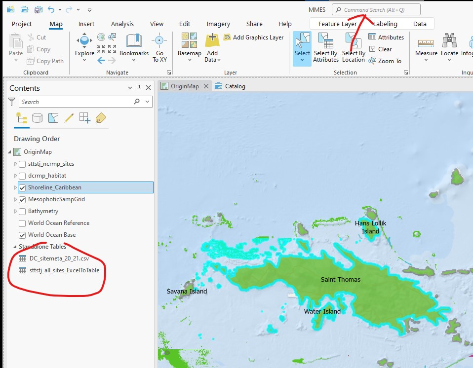
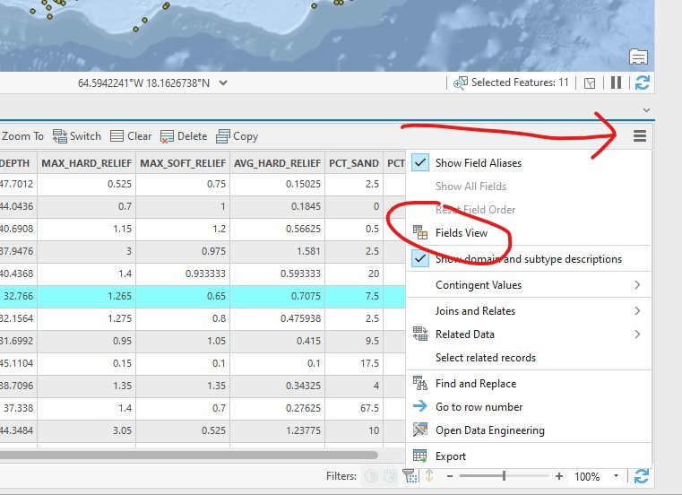
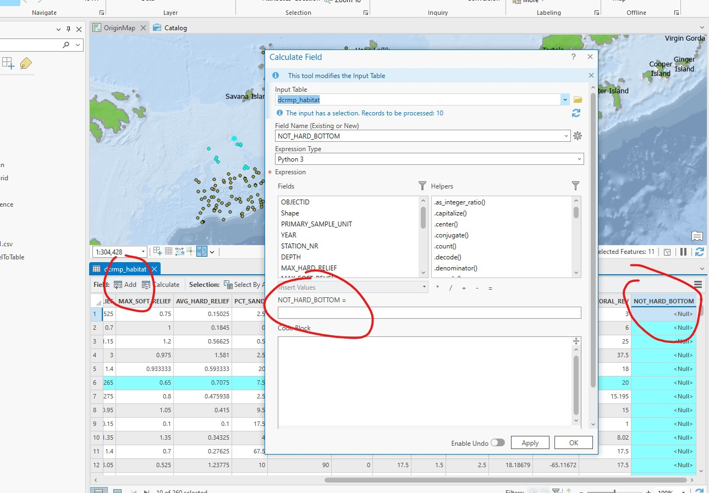

```{r setup, include=FALSE}
knitr::opts_chunk$set(echo = TRUE)
```

All the data (.xlsx and .csv) are located in the One Drive folder I shared.  In this lab you will begin with importing some National Coral Reef Monitoring data sets and then running some general geoprocessing tools. 

1. Begin a new project in ArcGIS using the Map template.  This will set you up with a base map layer  and a geodatabase.  You should use this project for the rest of the course labs.

2. Import the caribbean_shoreline shapefile.  
    - Should this shapefile go into your geodatabase that was created when you created the project?
    - Inspect the attribute table to understand how the data is organized. 

3. Select the U.S. Virgin Islands attributes and make a new layer from selection. 
    - Inspect the attribute table.  Edit (in line) the "Island" attribute.
    
4. Use the dissolve tool on the previous shapefile to create a single record element. 
    - What are the pros and cons of using the dissolved layer vs. the undissolved layer?
  
5. Label the features on the U.S. Virgin Islands shoreline shapefile.

6. Import the DCRMP and NCRMP data sets to the contents pane.  Can you drag and drop?  Use the search tool if needed.

<center>
{ width=50% }
</center>

7. Create point shapfiles for each of the data sets.  Hint...right-click the layer you want to plot and 'Display XY Data'.  Don't forget about setting the geographical coordinate system.
    - Should these go into your project geodatabase?

### The Following qustions use the NCRMP_sites shapefile you just created.  All these questions should look familiar.
1. How many samples are in the data set?         

2. How many unique habitat types are there?  What are the names of each habitat?

3. How many sites are there in the "PVMT" habitat type?

4. How many sites are there in the "PVMT" or "AGRF" habitat types?

5. How many sites are there in all the habitat types EXCEPT "PVMT"?

6. What is the northern most site sampled in the "BDRK" habitat?

7. What is the western most site sampled in either "AGRF" or "PTRF" habitat?

8. How many years were surveyed in the data set?

9. What is the southern most site sample in the "PVMT" habitat in 2004?

### The Following qustions use the DCRMP_sites shapefile you just created.

1. Select the top 10% of sites by PCT_CORAL.  Make a new layer from selection.

2. Select sites that are deeper than 40m.  Make new layer from selection.

3. Select sites that are within 5km of Sail Rock.  Make new layer from selection.

4. Using the entire DCRMP_sites feature.  Create a new field in the attribute table named NOT_HARD_BOTTOM.  Set its type to double

<center>
{ width=50% }
</center>

5. Use the calculate field tool to open up the field calculator and write an expression to add together the 
 PCT_SAND and PCT_RUBBLE fields.
<center>
{ width=50% }
</center>
